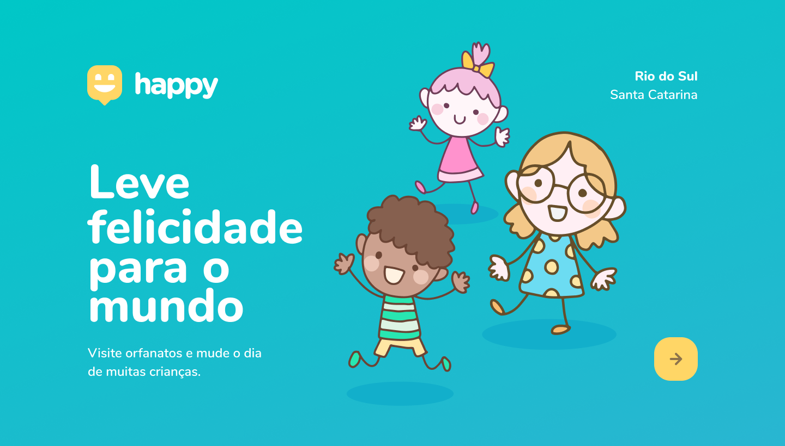
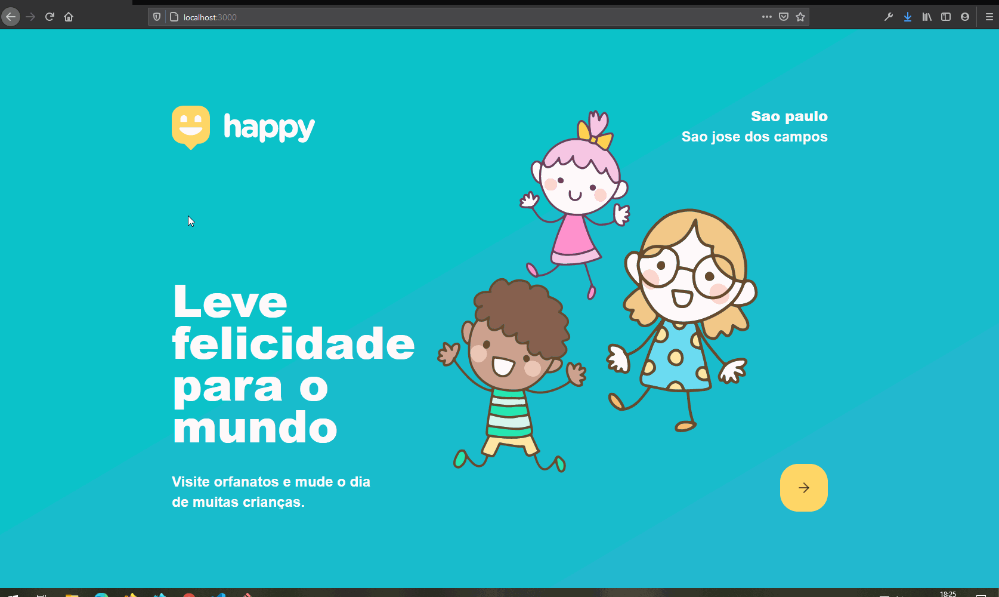
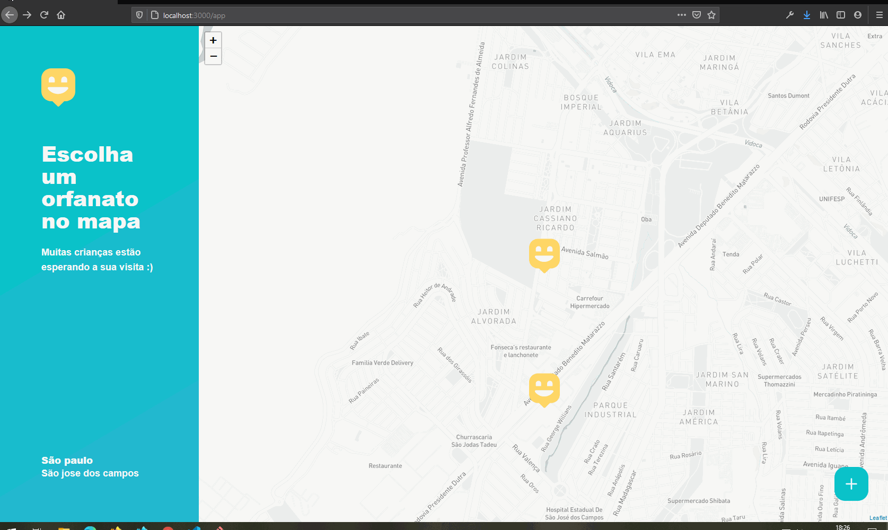

<h3 align="center">
<b>Semana Next Level Week 3 <p><a href="https://rocketseat.com.br"></a></p></b>

</h3></b></br>

      
   
------------------
</br>

## Sobre o projeto que foi desenvolvido:

O projeto foi ministrado pelo <a href="https://github.com/diego3g">Diego fernandes</a>, CTO da <a href="http://rocketseat.com.br">Rocketseat</a> e foi inspirado pelo dia das crianças

</br>

## Happy

O Happy é uma aplicação que conecta pessoas à casas de acolhimento institucional para fazer o dia de muitas crianças mais feliz 💜
</br></br>

  
</br></br>

  
</br></br>

  
</br></br>

---

</br>
 
## 🚀  <strong>Tecnologias utilizadas:</strong>

- Css
- ReactJs
- Node.Js
- TypeScript
  </br></br>

## 💻 Como Utilizar

```bash

# clonar o repositório
$ git clone https://github.com/ivopereira-jr/Next-Level-Week-3.git

# instalar as dependências
$ yarn install
$ npm install

# para iniciar
web
$ yarn start
$ npm start

back-end
$ yarn dev


Obs. Você pode utlizar npm ou yarn eu utilizei o yarn
```

</br>
</br>

## 💬 Fale comigo

[_Entre em contato comigo_](https://www.linkedin.com/in/ivopereira-jr/)

Obrigado por chegar até aqui!
